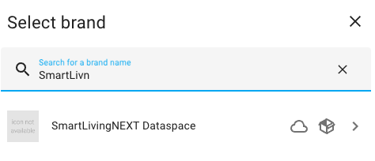
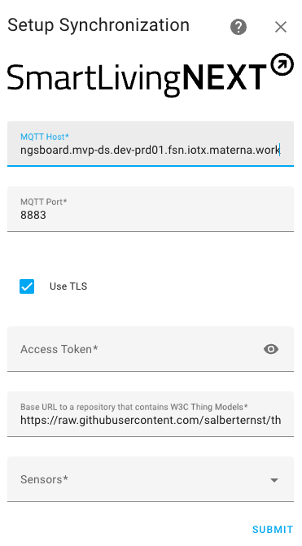

# ha_thingsboard

Synchronizes home assistant sensors over MQTT to a SmartLivingNEXT dataspace.

## Install

Clone or copy the repository and copy the folder 'ha_thingsboard/thingsboard' into '/config/custom_components/thingsboard'

## Usage

To enable the synchronization to a SmartLivingNEXT dataspace go to ```Settings > Devices and Services > Add Integration```

Search for ```SmartLivingNEXT Dataspace``` and click on it: 


Enter the ```MQTT Host``` and ```Access Token``` provided by your dataspace provider: 


Select the device classes (like power, data_rate or humidity) to synchronize with the dataspace and confirm by pressing ```Submit```.

__ALL__ entities with selected device classes will be synchronized. There is currently no way of selecting specific devices or entities to synchronize.

You can change the configuration later on by selecting ```Reconfigure``` in the SmartLivingNEXT Dataspace integration.


### Model Repository

W3C Thing Descriptions are automatically generated using Thing Models in the Thing Describer. A Thing Model acts like a template that is converted by the Thing Describer into a valid Thing Description with all endpoints.

Thing Models are provided for the most common device classes in the default [repository](https://raw.githubusercontent.com/salberternst/thing-models/main/home_assistant).

To provide custom models for your devices/entities you need to provide a link to a repository which stores them. For the final thing model the following url is used ```$REPOSITORY_URL/$DEVICE_CLASS.json``` e.g. ```https://https://raw.githubusercontent.com/example/example-thing-model-repository/main/power.json```

## Authors

Sebastian Alberternst <sebastian.alberternst@dfki.de>

## License

MIT

